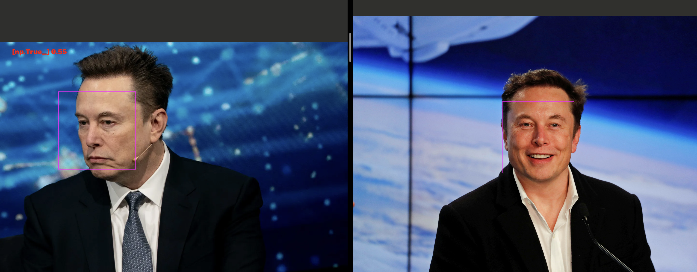

# Face Recognition with Python 

A simple face recognition project built with Python that detects faces in images, generates facial encodings, and compares two faces to determine whether they are likely to belong to the same person.

## Features

* Detects faces in images
* Generates numerical face encodings
* Compares facial encodings between images
* Calculates face distance to show similarity
* Displays detected faces with bounding boxes
* Demonstrates both matching and non-matching faces

## Example

The project uses images of Elon Musk and Bill Gates to demonstrate face matching.

A reference image of Elon Musk is compared with:

* Another image of Elon Musk → expected match
* An image of Bill Gates → expected non-match



## Tech Stack

* **Python** — application development
* **face-recognition** — face detection, encoding and comparison
* **OpenCV** — image processing and displaying results

## How It Works

The program first loads the reference and test images and converts them into the required colour format.

It then detects the face in each image and generates a numerical **face encoding** representing facial features.

The encodings are compared using the `face_recognition` library:

* `compare_faces()` determines whether the faces are considered a match.
* `face_distance()` calculates the numerical distance between the facial encodings. A smaller distance indicates greater similarity.

The detected faces are then displayed with bounding boxes, along with the comparison result and face distance.

## Project Structure

```text
FaceRecognitionProject/
├── images/
│   ├── Elon_Musk.jpg
│   ├── Elon_Musk_test.webp
│   └── Bill_gates.webp
├── main.py
├── requirements.txt
├── .gitignore
└── README.md
```

## Installation

Clone the repository:

```bash
git clone <repository-url>
cd FaceRecognitionProject
```

Create and activate a virtual environment:

```bash
python -m venv .venv
source .venv/bin/activate
```

Install the dependencies:

```bash
pip install -r requirements.txt
```

## Running the Project

Run:

```bash
python main.py
```

Two image windows will open showing the detected faces and the comparison result.

## What I Learned

This project helped me develop practical experience with computer vision and face recognition, including image processing with OpenCV, facial feature encoding, similarity comparison, and working with Python libraries and virtual environments.

## Future Improvements

* Support multiple faces in a single image
* Compare faces against a larger collection of known people
* Add a confidence or similarity score
* Build a real-time webcam recognition system
* Improve handling of images containing no detected faces
